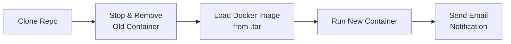

# 🚀 NestJS CI/CD Pipeline — Jenkins + Docker


A NestJS application with an automated deployment pipeline built in **Jenkins** — covering repository checkout, container lifecycle management, deployment, and automatic email notification on successful deploy.

---

## 📌 Overview

This project demonstrates a Jenkins-driven deployment flow for a containerized NestJS app:

1. Pull the latest code from GitHub
2. Stop and remove any previously running container
3. Load a pre-built Docker image (from a local `.tar` archive)
4. Run the new container
5. Send an email notification confirming the app is live

---

## 🏗️ Pipeline Flow



---

## ⚙️ Tech Stack

| Layer | Technology |
|---|---|
| Framework | NestJS |
| Runtime | Node.js 18 (Alpine base image) |
| Containerization | Docker |
| CI/CD | Jenkins (Declarative Pipeline) |
| Notifications | Jenkins Email Extension (`emailext`) |

---

## 📂 Project Structure

```
.
├── src/                    # NestJS application source
├── dist/                   # Compiled output (generated by `npm run build`)
├── package.json
├── package-lock.json
├── Dockerfile
└── Jenkinsfile
```

---

## 🐳 Dockerfile Breakdown

```dockerfile
FROM node:18-alpine
WORKDIR /app
COPY package*.json ./
RUN npm install
COPY . .
RUN npm run build
EXPOSE 3000
CMD ["node", "dist/main"]
```

- Uses the lightweight **`node:18-alpine`** base image
- Installs dependencies first (`package*.json` copied before the rest of the source) to take advantage of Docker layer caching
- Runs `npm run build`, producing the compiled `dist/` output
- Exposes port `3000` and starts the app with `node dist/main`

---

## ⚙️ Jenkins Pipeline Breakdown

### Environment Variables
| Variable | Purpose |
|---|---|
| `CONTAINER_NAME` | Name assigned to the running container (`nestjs-app`) |
| `IMAGE_NAME` | Docker image name (`nest_js_cicd`) |
| `PORT` | Application port, mapped host↔container (`3000`) |
| `EMAIL` | Recipient for deployment notifications |
| `TAR_PATH` | Path to the pre-built Docker image archive on the Jenkins agent |

### Stages

**1. Clone Repo**
Checks out the `main` branch from the GitHub repository.

**2. Stop & Remove Old Container**
Gracefully stops and removes any existing container with the same name, so redeploys don't fail due to a name/port conflict. Uses `|| true` so the stage doesn't fail on a fresh agent where no container exists yet.

**3. Load Docker Image**
Loads a Docker image from a local `.tar` archive (`docker load -i`) rather than building it in this stage — see note below.

**4. Run Container**
Starts a new detached container, mapping the configured port and naming it for the next deployment cycle to manage.

**5. Send Email Notification**
Uses the Jenkins **Email Extension Plugin** (`emailext`) to notify on successful deployment, including a direct link to the running app.

---

## ⚠️ Design Decision: Local Build + `scp` + `docker load` (instead of building on the EC2 agent)

This pipeline **loads** a pre-built Docker image from a `.tar` file (`docker load -i ${TAR_PATH}`) rather than running `docker build` directly on the Jenkins agent. This was a deliberate choice, not an oversight:

- The Jenkins agent runs on an **EC2 `t2.micro`** instance — with only 1 vCPU and 1 GB RAM, running `npm run build` + `docker build` on it either **failed outright** (out of memory / CPU throttling) or took a very long time due to CPU credit exhaustion on the burstable instance
- To work around this, the Docker image is instead **built locally** (on a more capable machine) and then transferred to the EC2 agent using `scp`:
  ```bash
  docker build -t nest_js_cicd:latest .
  docker save -o nestjs-app.tar nest_js_cicd:latest
  scp nestjs-app.tar ubuntu@<ec2-ip>:/home/ubuntu/nestjs-app.tar
  ```
- The Jenkins pipeline then simply **loads** this already-built image (`docker load -i ${TAR_PATH}`) and runs it — a lightweight operation that a `t2.micro` handles comfortably

**Trade-off:** code changes pulled in the "Clone Repo" stage aren't automatically reflected in the deployed container — the `.tar` must be rebuilt locally and re-copied to the agent before each deploy. This is an intentional trade-off to keep the pipeline usable on low-resource, low-cost infrastructure, rather than upgrading the EC2 instance type solely to support in-pipeline builds.

**If moving to a larger instance type (e.g. `t3.medium` or above) in the future**, the pipeline can be simplified by adding a build stage directly before "Load Docker Image", removing the manual `scp` step entirely:

```groovy
stage("Build Docker Image") {
    steps {
        sh '''
        echo "Building new image..."
        sudo docker build -t ${IMAGE_NAME}:latest .
        '''
    }
}
```

---

## 🚀 Getting Started

### Prerequisites
- Jenkins server with:
  - Docker installed and accessible to the Jenkins user (or via `sudo`)
  - **Email Extension Plugin** installed and configured (SMTP settings)
- GitHub repository access (public in this case, no credentials needed for clone)

### Setup

1. Create a new Jenkins Pipeline job
2. Point it to this repository's `Jenkinsfile` (or paste the pipeline script directly)
3. Ensure Jenkins has permission to run `docker` commands (add the `jenkins` user to the `docker` group, or confirm `sudo` access is configured without a password prompt)
4. Before running the pipeline, build and transfer the image from a local machine (since the EC2 agent's `t2.micro` size can't reliably build it):
   ```bash
   # On your local machine
   docker build -t nest_js_cicd:latest .
   docker save -o nestjs-app.tar nest_js_cicd:latest
   scp nestjs-app.tar ubuntu@<ec2-ip>:/home/ubuntu/nestjs-app.tar
   ```
5. Run the pipeline manually, or configure a GitHub webhook to trigger it on every push to `main`

### Verify deployment
```bash
docker ps --filter "name=nestjs-app"
curl http://localhost:3000
```

---

## 🎯 Key Learnings

- Writing a **Declarative Jenkins Pipeline** with clearly separated stages
- Managing container lifecycle safely with idempotent stop/remove logic (`|| true`)
- Integrating **automated email notifications** into a deployment pipeline
- Understanding the difference between **loading a pre-built image** vs. **building fresh on every run**, and making a deliberate infrastructure trade-off (local build + `scp` + `docker load`) to work within the CPU/memory limits of a `t2.micro` Jenkins agent

---

## 🔮 Possible Improvements

- Push images to a registry (Docker Hub, ECR) instead of a manually `scp`'d `.tar` file — this would remove the manual local-build step while still avoiding heavy builds on the `t2.micro` agent (build could run in GitHub Actions or a separate build server, then just be `docker pull`ed by Jenkins)
- If budget allows, upgrade the Jenkins agent to a larger instance type (`t3.medium`+) and add an in-pipeline **Build Docker Image** stage to fully automate builds
- Add a **Test** stage (`npm run test`) before deployment to catch regressions
- Add a **health check** step after `docker run` to confirm the container is actually serving traffic before sending the success email
- Parameterize the pipeline (branch name, image tag) for multi-environment deployments (dev/staging/prod)
- Add credentials-based GitHub checkout if the repository ever becomes private

---

## 👩‍💻 Author

**Saba Ramzan**
Computer Science Student | DevOps & Cloud Engineer
